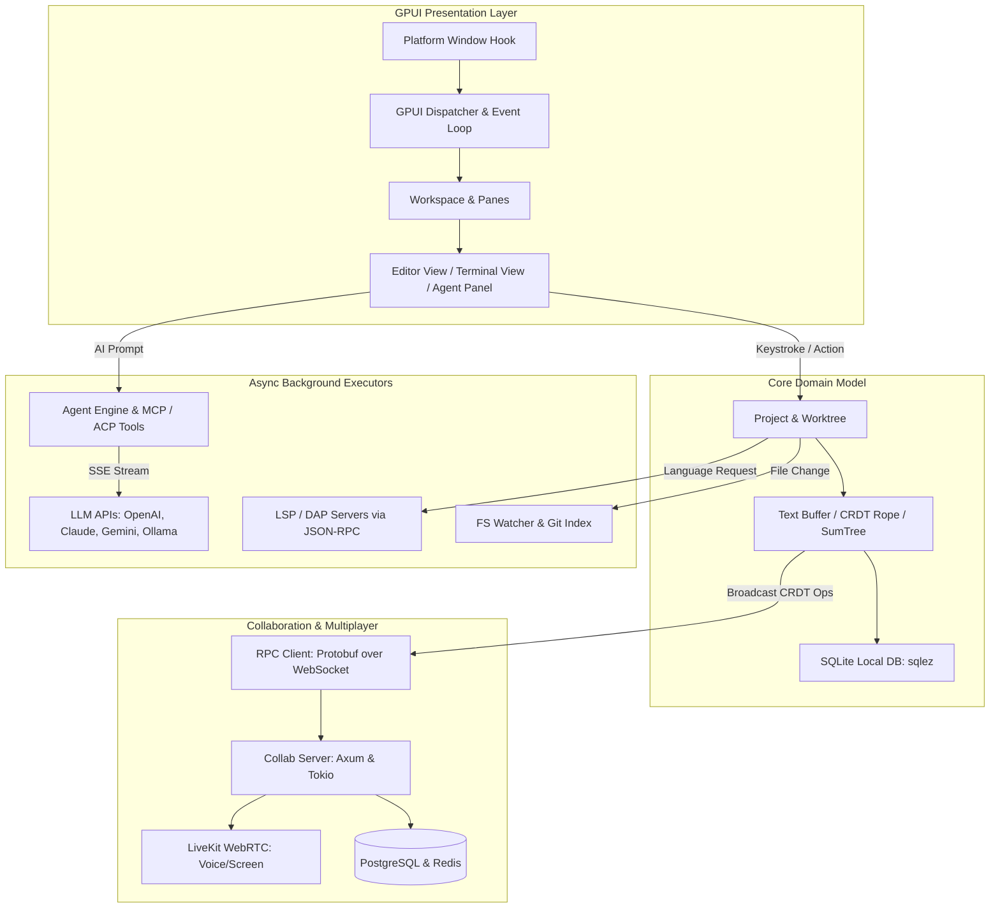
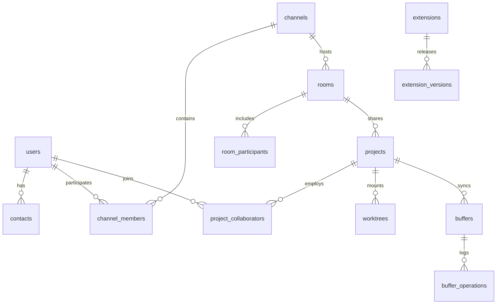

# Panduan Analisis Project untuk Rebuild: Makarya IDE (Zed)

> **Tujuan file ini:** Hasil analisis komprehensif terhadap codebase `makarya-ide` (berbasis upstream `zed-industries/zed`). File ini berfungsi sebagai **blueprint teknis lengkap** untuk merebuild, mem-fork, atau memodifikasi codebase menjadi IDE modern berkinerja tinggi.

---

## 1. Ringkasan Project

- **Nama project:** Makarya IDE (berbasis Zed Editor / `zed-industries/zed`)
- **Deskripsi singkat (1-2 kalimat):** Code editor dan IDE modern generasi baru berkinerja sangat tinggi yang dirender langsung di GPU menggunakan GPUI, mendukung pair-programming kolaboratif real-time, terminal terintegrasi, arsitektur ekstensi berbasis WebAssembly, dan integrasi multi-agent AI native (ACP & MCP).
- **Target user / use case utama:** Software developers dan engineers yang membutuhkan text editor/IDE dengan latency ultra-rendah (60-120 FPS tanpa frame drop), hemat resource (alternatif ringan untuk VS Code/Electron), kolaborasi multiplayer real-time, dan workflow AI interaktif terpadu.
- **Status:** Production-grade / Active Open Source Project (Upstream Zed v1.22.0+ / Edition 2024).

---

## 2. Tech Stack

| Layer | Teknologi | Versi | Catatan |
|---|---|---|---|
| **Bahasa utama** | Rust | Edition 2024 (Toolchain 1.98.1) | Digunakan di seluruh workspace (client GUI, CLI, server backend, remote host). |
| **Extension Runtime** | WebAssembly (WASI) | `wasm32-wasip2` | Sandboxed WASM runtime ditenagai oleh `wasmtime`. |
| **UI Framework** | GPUI (In-house) | `0.2.2` | Framework UI reaktif berbasis GPU buatan Zed team dengan flexbox layout styling mirip Tailwind. |
| **Renderer Backend** | DirectX 11/12 (Windows), Metal (macOS), Vulkan/Blade/WGPU (Linux/Web) | - | Native hardware acceleration langsung ke GPU tanpa WebView/Chromium. |
| **Framework Backend** | Axum & Tokio | Axum `0.6`, Tokio `1.x` | Backend service `collab` untuk koordinasi kolaborasi multiplayer real-time dan API server. |
| **Database (Server)** | PostgreSQL | SQLx `0.8`, SeaORM `1.1.10` | Database relasional untuk user, project rooms, channels, notifications, dan extension registry. |
| **Database (Client)** | Embedded SQLite | `sqlez` & `rusqlite` | Penyimpanan lokal untuk session, workspace tabs, layout, cursor position, dan AI conversation threads. |
| **Cache / Queue** | Redis & AWS Kinesis | Redis (tokio), AWS SDK `1.51` | Pub/Sub session antar-pod server collab dan event streaming telemetry. |
| **Audio / Video Calling**| LiveKit (WebRTC) | `livekit_api`, `livekit_client` | Voice channels & screen sharing di dalam collaborative rooms. |
| **Syntax Parsing** | Tree-sitter | C-ABI & Rust bindings | Parsing inkremental AST untuk syntax highlighting dan code outline super cepat. |
| **Terminal Engine** | `alacritty_terminal` | - | VT100 / Xterm PTY parser untuk terminal terintegrasi. |
| **Auth** | GitHub OAuth & Zed Cloud Tokens | - | Autentikasi user via GitHub OAuth dan Zed Cloud API tokens. |
| **RPC & Serialisasi** | Protocol Buffers (Prost) & JSON-RPC | `prost 0.13`, `serde_json` | Protokol komunikasi biner efisien client-server dan JSON-RPC untuk LSP/DAP/MCP. |
| **Deployment / Hosting** | Docker, Kubernetes, AWS S3, Cloudflare | - | Blob storage untuk update binary & extensions (S3), routing & country detection (Cloudflare). |
| **CI/CD** | GitHub Actions & Nix | - | Automated build, cross-platform release packaging, and automated license checks via `cargo-about`. |
| **Package Manager** | Cargo (Cargo Workspace) | Resolver 2 | Monorepo masif yang terdiri dari 245+ internal crates. |

---

## 3. Struktur Direktori

```
makarya-ide/
├── .agents/                 # AI agent skills & automated workflows
├── .github/workflows/       # CI/CD pipeline (tests, builds, release packaging)
├── assets/                  # Icons, fonts (Zed Plex, Nerd Fonts), sounds, themes
├── crates/                  # Monorepo berisikan 245+ crates modular
│   ├── zed/                 # Entry point aplikasi utama (GUI Desktop application)
│   ├── cli/                 # Command-line interface executable (`zed` command)
│   ├── collab/              # Real-time collaboration server backend & HTTP/WS API
│   ├── remote_server/       # Headless server untuk remote development over SSH
│   ├── gpui/                # Core GPU-accelerated UI framework
│   │   ├── gpui_windows/    # Platform implementation Windows (DirectX, DirectWrite)
│   │   ├── gpui_macos/      # Platform implementation macOS (Metal, Cocoa)
│   │   ├── gpui_linux/      # Platform implementation Linux (Wayland, X11, Vulkan)
│   │   └── gpui_wgpu/       # WGPU/Blade fallback rendering backend
│   ├── workspace/           # Window, dock, panel, tab, pane, modal orchestration
│   ├── editor/              # Core code editor component, selections, multi-cursor, gutter
│   ├── text/                # CRDT Rope text buffer, Lamport clocks, SumTree
│   ├── rope/                # Persistent data structure untuk manipulasi teks cepat
│   ├── sum_tree/            # B-Tree variant terindeks untuk tracking offset dan newline
│   ├── project/             # Project workspace model, worktrees, file watcher, git index
│   ├── language/            # Syntax highlighting, Tree-sitter integration, grammar loading
│   ├── lsp/                 # Language Server Protocol client
│   ├── dap/                 # Debug Adapter Protocol client
│   ├── agent/               # AI Assistant core, subagent orchestration, tool routing
│   ├── agent_ui/            # Agent panel, conversation thread UI, prompt cards
│   ├── acp_tools/           # Agent Client Protocol & model context tools
│   ├── context_server/      # MCP (Model Context Protocol) client implementation
│   ├── language_models/     # Integrasi LLM (OpenAI, Anthropic, Google, Ollama, DeepSeek, dll)
│   ├── terminal/            # PTY integration & alacritty_terminal bindings
│   ├── terminal_view/       # Terminal pane UI & rendering di dalam GPUI
│   ├── extension/           # Manifest ekstensi, dependency solver, API definition
│   ├── extension_host/      # Wasmtime WASI sandbox executor untuk ekstensi
│   ├── db/                  # SQLite client-side persistence menggunakan sqlez
│   ├── sqlez/               # Type-safe SQLite wrapper & migration engine
│   └── rpc/                 # Protobuf definitions & async RPC framing
├── docs/                    # Dokumentasi developer & manual instalasi
├── extensions/              # Built-in extensions (GLSL, HTML, Proto, dll.)
├── script/                  # Build scripts, clippy wrappers, license checker, bundle release
└── tooling/                 # Custom Dylint lints, compliance tools, xtask
```

### Penjelasan Folder Kunci:
- **`crates/zed/`**: Pintu masuk utama aplikasi desktop. Menginisialisasi event loop platform, menu sistem, IPC listener untuk CLI, load user settings, membuka window, dan menyambungkan seluruh sub-sistem.
- **`crates/gpui/` & platform crates**: Jantung dari performa Zed. Framework UI immediate-reaktif yang memproses layout flexbox, font rasterization, hit-testing, event dispatching, dan rendering batch ke vertex buffer GPU setiap frame.
- **`crates/text/`, `rope/`, `sum_tree/`**: Fondasi struktur data editor. Menggunakan variant B-Tree bernama `SumTree` yang dibungkus `Rope`, digabungkan dengan Lamport timestamps dan vector clocks untuk menghasilkan text buffer CRDT yang mampu merge editan multi-user tanpa konflik.
- **`crates/workspace/` & `editor/`**: Mengelola seluruh antarmuka interaktif: pembagian pane (split panes), dock samping/bawah (project panel, terminal, agent panel), tab switcher, multi-cursor, inline diffs, dan scroll synchronization.
- **`crates/collab/`**: Server independen berbasis Axum dan SeaORM/PostgreSQL. Bertanggung jawab atas persistensi akun user, sharing workspace, routing operasi CRDT antar pengguna di room yang sama, dan sinkronisasi audio channel WebRTC via LiveKit.
- **`crates/agent/` & `language_models/`**: Subsistem kecerdasan buatan. Mendukung berbagai penyedia model (Anthropic Claude, OpenAI GPT, Google Gemini, Ollama lokal), serta protokol modern ACP (Agent Client Protocol) dan MCP (Model Context Protocol).
- **`crates/extension_host/`**: Sandbox keamanan berbasis WebAssembly (Wasmtime). Menjamin bahasa pemrograman baru, tema, linter, dan debugger tambahan dapat dijalankan tanpa hak akses sistem sembarangan.

---

## 4. Arsitektur & Alur Data

- **Pola arsitektur:** Micro-Crate Modular Monorepo dengan Reactive Entity-Component architecture di frontend (GPUI), CRDT-based distributed state synchronization, dan asynchronous actor-like message handling.
- **Entry point aplikasi:**
  - Desktop Editor: [`crates/zed/src/main.rs`](file:///d:/Project/Other/makarya-ide/crates/zed/src/main.rs)
  - CLI Companion: [`crates/cli/src/main.rs`](file:///d:/Project/Other/makarya-ide/crates/cli/src/main.rs)
  - Collab Backend Server: [`crates/collab/src/main.rs`](file:///d:/Project/Other/makarya-ide/crates/collab/src/main.rs)
  - Remote Headless Host: [`crates/remote_server/src/main.rs`](file:///d:/Project/Other/makarya-ide/crates/remote_server/src/main.rs)
- **Alur request tipikal (User keystroke / edit):**
  1. OS Input Event (Keyboard / Mouse) ditangkap oleh platform window hook (`gpui_windows` / `DirectInput` / `WndProc`).
  2. GPUI Dispatcher mengubah event menjadi GPUI Action atau Input Text.
  3. Action diteruskan ke `FocusHandle` dari active `Editor` view.
  4. `Editor` memanggil mutasi pada `Buffer` di `crates/text`.
  5. `Buffer` memodifikasi struktur `SumTree` / `Rope`, membuat transaction log dengan Lamport timestamp lokal, dan menghitung `Patch`.
  6. Buffer memicu event `Edited`. Jika sedang dalam sesi kolaborasi, operasi CRDT diserialisasi via `prost` dan dikirim melalui WebSocket RPC (`crates/rpc`) ke server `collab`.
  7. View memanggil `cx.notify()`, menandai sub-tree UI kotor (dirty).
  8. GPUI menjalankan layout pass, mengupdate text layout & glyph atlas (`directx_atlas.rs`), lalu merender quad batched ke Direct3D/Metal command list.
  9. Frame dipresentasikan ke layar pada tick VSync berikutnya (60-120 FPS).
- **State management:** GPUI Entity System (`Entity<T>`, `WeakEntity<T>`, `Context<T>`, `AsyncWindowContext`). Memanfaatkan closure `cx.observe()`, `cx.subscribe()`, dan `cx.listener()`. Semua mutasi state UI berjalan deterministik di foreground main thread, sedangkan I/O berat (LSP, file scanning, git status, AI streaming) didelegasikan ke `cx.background_spawn()`.
- **Komunikasi antar service:**
  - Client ↔ Collab Server: WebSocket stream dengan Protobuf RPC frames.
  - Client ↔ LSP / DAP: JSON-RPC over stdin/stdout proses background.
  - Client ↔ LLM Providers: HTTPS HTTP/2 with Server-Sent Events (SSE) streaming chunks.
  - Client ↔ Local CLI: Local IPC domain sockets / Windows named pipes (`IpcOneShotServer`).

### Diagram Alur Arsitektur



---

## 5. Data Model / Skema Database

Project ini membagi penyimpanan data menjadi dua ranah utama: **Server-side (PostgreSQL via SeaORM)** dan **Client-side (SQLite via Sqlez)**.

### A. Skema Server (`crates/collab/src/db/tables.rs`)
1. **Identitas & Relasi User:**
   - `users`: id, github_user_id, github_login, admin, created_at, connected_to_his_call.
   - `contacts`: user_id_a, user_id_b, status (pending, accepted).
   - `followers`: leader_id, follower_id.
2. **Ruang Kerja & Kolaborasi:**
   - `channels`: id, name, visibility (public/private), parent_path.
   - `channel_members`: channel_id, user_id, role (admin/member).
   - `rooms`: id, livekit_room, channel_id.
   - `room_participants`: room_id, user_id, calling, answering.
   - `projects`: id, room_id, host_user_id, connection_id.
   - `project_collaborators`: project_id, user_id, replica_id.
   - `worktrees`: id, project_id, root_name, abs_path.
3. **Persistensi Buffer Bersama:**
   - `buffers`: id, project_id, channel_id.
   - `buffer_operations`: buffer_id, epoch, lamport_timestamp, replica_id, operation_data.
   - `buffer_snapshots`: buffer_id, text, version.
4. **Extension Registry:**
   - `extensions`: id, external_id, name, total_downloads.
   - `extension_versions`: extension_id, version, schema_version, published_at.

### B. Skema Client (`crates/db`)
Registrasi migrasi link-time menggunakan makro `db::static_connection!`:
- `WorkspaceDb`: ID window, lokasi workspace, layout pane terbagi, dock terbuka, ukuran window.
- `EditorDb`: File scroll position, cursor anchor, folded code ranges.
- `TerminalDb`: Working directories tab terminal aktif, task command history.
- `ThreadMetadataDb`: History chat AI assistant, ID thread, model yang dipilih, token metrics.
- `KeyValueStore`: Key-value cache global (flag onboarding, auth session token, telemetry opt-in).

### ERD Skema Utama (Server Collab)



- **Lokasi file migrasi:**
  - Server: [`crates/collab/migrations/`](file:///d:/Project/Other/makarya-ide/crates/collab/migrations)
  - Client: Tersebar di crate masing-masing via inventory makro (contoh: [`crates/workspace/src/persistence.rs`](file:///d:/Project/Other/makarya-ide/crates/workspace/src/persistence.rs), [`crates/editor/src/persistence.rs`](file:///d:/Project/Other/makarya-ide/crates/editor/src/persistence.rs)).

---

## 6. Fitur & Modul Utama

### Fitur 1: Core Text Editor & High-Performance Rendering
- **Deskripsi:** Editor kode dengan zero input latency, rendering teks pada 120 FPS menggunakan shader GPU, multi-cursor, bracket matching, code folding, soft wrap, dan minimap.
- **File/folder terkait:** [`crates/editor/`](file:///d:/Project/Other/makarya-ide/crates/editor/), [`crates/text/`](file:///d:/Project/Other/makarya-ide/crates/text/), [`crates/gpui/`](file:///d:/Project/Other/makarya-ide/crates/gpui/)
- **Dependency eksternal:** Tree-sitter, Direct3D/Metal/Vulkan, DirectWrite / FreeType.
- **Business logic penting yang harus dipertahankan:** Struktur data `SumTree` untuk navigasi posisi baris/kolom secara $O(\log N)$ dan non-blocking rendering pipeline.

### Fitur 2: Real-time Multiplayer Collaboration
- **Deskripsi:** Sinkronisasi pengetikan banyak pengguna dalam satu dokumen (Google Docs style untuk code), shared terminal, live screen/cursor sharing, dan built-in audio calls.
- **File/folder terkait:** [`crates/collab/`](file:///d:/Project/Other/makarya-ide/crates/collab/), [`crates/rpc/`](file:///d:/Project/Other/makarya-ide/crates/rpc/), [`crates/livekit_client/`](file:///d:/Project/Other/makarya-ide/crates/livekit_client/)
- **Dependency eksternal:** LiveKit WebRTC, Prost (Protobuf), WebSockets, PostgreSQL, Redis.
- **Business logic penting yang harus dipertahankan:** Vector Clock dan Lamport timestamp CRDT merge algorithm untuk mencegah race condition atau desync teks antar pengguna.

### Fitur 3: Native AI Assistant & Multi-Agent System (ACP & MCP)
- **Deskripsi:** Panel AI kontekstual yang mendukung inline code generation, terminal commands suggestion, automated tool calling (file search, buffer edit, bash run), subagent spawning, serta integrasi MCP (Model Context Protocol).
- **File/folder terkait:** [`crates/agent/`](file:///d:/Project/Other/makarya-ide/crates/agent/), [`crates/agent_ui/`](file:///d:/Project/Other/makarya-ide/crates/agent_ui/), [`crates/context_server/`](file:///d:/Project/Other/makarya-ide/crates/context_server/), [`crates/acp_tools/`](file:///d:/Project/Other/makarya-ide/crates/acp_tools/)
- **Dependency eksternal:** Provider LLM APIs (Anthropic, OpenAI, Google, DeepSeek, Ollama), Reqwest, SSE parsers.
- **Business logic penting yang harus dipertahankan:** Streaming token handling langsung ke GPUI entity tanpa lag pada antarmuka utama, serta sandboxing izin eksekusi tool calling.

### Fitur 4: Language Server Protocol (LSP) & Debug Adapter Protocol (DAP)
- **Deskripsi:** Dukungan intelijen kode lengkap (autocomplete, jump to definition, hover documentation, rename symbol, code actions) dan debugging interaktif (breakpoints, call stack, variables).
- **File/folder terkait:** [`crates/lsp/`](file:///d:/Project/Other/makarya-ide/crates/lsp/), [`crates/dap/`](file:///d:/Project/Other/makarya-ide/crates/dap/), [`crates/languages/`](file:///d:/Project/Other/makarya-ide/crates/languages/)
- **Dependency eksternal:** Berbagai binary language server (`rust-analyzer`, `pyright`, `gopls`, `vtsls`, dll.), standard JSON-RPC.
- **Business logic penting yang harus dipertahankan:** Sinkronisasi dokumen inkremental (didChange) berdasarkan delta buffer Rope tanpa perlu mengirim seluruh isi file.

### Fitur 5: WebAssembly Extension Ecosystem
- **Deskripsi:** Sistem plugin modular pihak ketiga untuk tema warna, ikon, dukungan bahasa baru, dan toolchains yang berjalan di dalam sandbox WASM WASI yang aman dan terisolasi.
- **File/folder terkait:** [`crates/extension/`](file:///d:/Project/Other/makarya-ide/crates/extension/), [`crates/extension_host/`](file:///d:/Project/Other/makarya-ide/crates/extension_host/)
- **Dependency eksternal:** `wasmtime`, `wasmtime-wasi`, `wasmparser`, `wasm-encoder`.
- **Business logic penting yang harus dipertahankan:** Komunikasi IPC efisien host-to-wasm via shared memory buffer.

### Fitur 6: Integrated Terminal & Background Task Runner
- **Deskripsi:** Terminal emulator performa tinggi yang disematkan langsung di dalam workspace dock, mendukung split terminal, tab, custom shell, dan eksekusi background tasks dari file `.zed/tasks.json`.
- **File/folder terkait:** [`crates/terminal/`](file:///d:/Project/Other/makarya-ide/crates/terminal/), [`crates/terminal_view/`](file:///d:/Project/Other/makarya-ide/crates/terminal_view/), [`crates/tasks_ui/`](file:///d:/Project/Other/makarya-ide/crates/tasks_ui/)
- **Dependency eksternal:** `alacritty_terminal`, OS PTY interfaces (`winpty`/`conpty` di Windows, `openpty` di Unix).
- **Business logic penting yang harus dipertahankan:** Fast scrollback buffer rendering menggunakan GPU instancing.

---

## 7. API / Interface Publik

### A. CLI Commands (`crates/cli`)

| Command | Parameter / Flag | Fungsi |
|---|---|---|
| `zed [paths...]` | `[path]` | Membuka file atau direktori proyek di jendela editor yang sudah ada atau baru. |
| `zed --wait [paths]` | `-w`, `--wait` | Menahan terminal hingga file/tab yang dibuka ditutup (cocok untuk `$EDITOR` di git commit). |
| `zed --new [paths]` | `-n`, `--new` | Memaksa membuka workspace di jendela baru. |
| `zed --add [paths]` | `-a`, `--add` | Menambahkan direktori ke dalam workspace yang sedang aktif. |
| `zed -` | `-` (stdin) | Membuka teks dari pipa stdin langsung ke buffer tanpa nama di editor. |
| `zed --foreground` | `--foreground` | Menjalankan aplikasi di latar depan dan mencetak log output langsung ke konsol. |

### B. Collab Server Endpoints (`crates/collab`)

| Method | Endpoint | Fungsi | Auth? |
|---|---|---|---|
| `GET` | `/api/healthz` | Health check probe untuk deployment kubernetes | Tidak |
| `GET` | `/api/version` | Mengambil versi server collab yang sedang aktif | Tidak |
| `GET` | `/api/users` | Pencarian user dan metadata profil | Ya (Bearer Token) |
| `GET` | `/api/extensions` | Mengambil katalog ekstensi terpublikasi | Tidak |
| `POST` | `/api/extensions/publish`| Mempublikasikan ekstensi baru ke registry | Ya (Zed Token) |
| `GET` | `/rpc` (WebSocket) | Koneksi socket biner utama untuk sinkronisasi CRDT buffer dan audio room | Ya (Handshake Auth) |

### C. Extension WASM Host API (`crates/extension_api`)
- Mengespor fungsi Rust WASI untuk: `init_extension`, `language_server_command`, `complete_slash_command`, `fetch_latest_server_version`.

---

## 8. Environment & Konfigurasi

### Environment Variables Kunci

| Nama Variabel | Fungsi | Default |
|---|---|---|
| `ZED_STATELESS` | Jika diset `1`, editor tidak menyimpan session database ke disk (mode ephemeral / testing). | `0` |
| `ZED_EXPERIMENTAL_A11Y` | Mengaktifkan screen-reader dan accessibility tree (AccessKit). | `0` |
| `FORCE_CLI_MODE` | Memaksa binary bertindak sebagai CLI client bukan GUI desktop. | `0` |
| `RUST_LOG` | Filter tracing dan level logging (`info`, `debug`, `trace`). | `info` |
| `DATABASE_URL` | URL koneksi PostgreSQL untuk server backend `collab`. | - |
| `REDIS_URL` | URL koneksi Redis untuk pub/sub server `collab`. | - |
| `LIVEKIT_URL` / `LIVEKIT_KEY` / `LIVEKIT_SECRET` | Kredensial server LiveKit untuk fitur voice chat dan room sharing. | - |
| `GITHUB_CLIENT_ID` / `GITHUB_CLIENT_SECRET` | Kredensial OAuth App GitHub untuk login pengguna. | - |
| `AWS_ACCESS_KEY_ID` / `AWS_SECRET_ACCESS_KEY` | Kredensial AWS S3 untuk update binary dan extension blob storage. | - |
| `ANTHROPIC_API_KEY` / `OPENAI_API_KEY` / `GOOGLE_AI_API_KEY` | API key penyedia AI (bisa diset di settings atau env). | - |

### File Konfigurasi Krusial
- `~/.config/zed/settings.json` (atau `%APPDATA%\Zed\settings.json` di Windows): Konfigurasi tema, font, LSP server settings, dan konfigurasi AI model.
- `~/.config/zed/keymap.json`: Custom keybindings pengguna.
- `.zed/tasks.json` & `.zed/settings.json`: Pengaturan spesifik per workspace/repository.

---

## 9. Dependencies Kunci

1. **`gpui` (In-House Crate)**: Jantung seluruh UI. Alasan: Framework GUI Rust yang ada (seperti Iced, Slint, Tauri) tidak memberikan kontrol rendering ultra-rendah level GPU yang dibutuhkan untuk editor 120 FPS.
2. **`tree-sitter`**: Parsing AST real-time. Alasan: Satu-satunya parser AST inkremental industri yang tahan error (fault-tolerant) dan mampu mem-parsing saat programmer sedang mengetik kode yang belum lengkap.
3. **`wasmtime`**: Host runtime WebAssembly. Alasan: Mesin WASM tercepat dan paling aman yang dikembangkan oleh Bytecode Alliance untuk mengeksekusi plugin tanpa risiko malware membahayakan OS user.
4. **`sea-orm` & `sqlx`**: Async ORM & query builder PostgreSQL di server collab. Alasan: Menyediakan type safety dan migrasi skema yang handal.
5. **`sqlez`**: Custom SQLite wrapper. Alasan: Sangat ringan, terintegrasi langsung dengan Rust async executor, dan mendukung auto-migrasi skema link-time.
6. **`alacritty_terminal`**: Library emulator terminal. Alasan: Parser escape sequence ANSI/VT yang sangat cepat dan teruji di industri.
7. **`prost`**: Kompilasi Protocol Buffers. Alasan: Serialisasi pesan biner berkecepatan tinggi dengan footprint memori sangat minim untuk sinkronisasi CRDT.

---

## 10. Testing

- **Framework Testing:**
  - `cargo test` didukung oleh makro `gpui::test` yang menyediakan mock deterministic executor (`TestAppContext`).
  - Visual Testing: `visual-tests` feature menggunakan `gpui_platform/screen-capture` untuk screenshot comparison.
- **Coverage Area:**
  - Unit tests: Logika CRDT buffer, SumTree operations, text patch, syntax resolution.
  - Integration tests: Collab client-server WebSocket sync (`crates/collab/tests/integration`), LSP communication, Extension loading.
  - Criterion Benchmarks: Kecepatan rendering GPUI, buffer search, workspace file scanning (`crates/benchmarks/`).
- **Cara Menjalankan Test:**
  ```bash
  # Menjalankan unit tests umum
  cargo test -p editor -p text -p workspace

  # Menjalankan integrasi test collab (membutuhkan fitur test-support)
  cargo test -p collab --features test-support

  # Menjalankan linting standar repo
  ./script/clippy
  ```

---

## 11. Known Issues / Technical Debt

- **Build Time Masif & Konsumsi Resource Kompilasi:** Monorepo dengan 245+ crate memerlukan waktu build awal yang lama (bisa memakan waktu 15–30 menit) dan RAM > 16GB saat linking binary `zed.exe`.
- **Kompleksitas Multi-Platform Graphics Backend:** Maintainer harus memelihara backend terpisah untuk DirectX (Windows), Metal (macOS), dan Wayland/Vulkan (Linux). Bug grafis di satu platform kerap membutuhkan debugging mendalam pada shader platform tersebut.
- **Ketergantungan Backend Collab pada Layanan Cloud Proprietary:** Server collab didesain untuk infrastruktur AWS (S3, Kinesis) dan LiveKit, sehingga self-hosting penuh secara mandiri membutuhkan konfigurasi mock atau substitusi layanan.
- **Pinning Toolchain Rust Nightly:** Sebagian tool lint internal (`tooling/lints`) mengandalkan compiler nightly tertentu, yang rentan pecah saat upgrade compiler.

---

## 12. Rencana Rebuild: Menuju "Makarya IDE"

> Panduan strategis jika ingin merebuild, mem-fork, atau membuat custom distribution dari codebase ini.

- **Alasan Rebuild / Forking:**
  1. Membuat IDE khusus (branded "Makarya IDE") yang disesuaikan untuk workflow pengembang lokal/spesifik.
  2. Mengeliminasi ketergantungan pada backend cloud proprietary (Zed Cloud) dan menggantinya dengan self-hosted collab atau local-first mode.
  3. Mengintegrasikan custom AI endpoints (misal: internal corporate LLM gateway) secara default out-of-the-box.
- **Strategi Rebuild yang Direkomendasikan:**
  - **Opsi 1 (Distribusi Fork Branded):** Pertahankan core `crates/` (GPUI, text, editor, workspace), ubah `APP_NAME` di [`crates/paths/src/paths.rs`](file:///d:/Project/Other/makarya-ide/crates/paths/src/paths.rs) menjadi `"Makarya"`, sesuaikan aset icon dan branding di `assets/`, serta arahkan server update & extension ke endpoint internal.
  - **Opsi 2 (Lightweight Standalone IDE):** Copot modul `crates/collab` dan cloud telemetry, jadikan editor murni offline-first / local development IDE dengan AI integration.
- **Fitur yang WAJIB ada di versi baru (Prioritas Tinggi):**
  1. GPUI rendering engine & high-performance Editor buffer (`SumTree`, `Rope`).
  2. Workspace layout management (Panes, Docks, Tabs, Command Palette, File Finder).
  3. Integrasi Language Server Protocol (LSP) untuk navigasi dan autocompletion kode.
  4. Integrated Terminal berbasis `alacritty_terminal`.
  5. Native AI Agent Panel dengan dukungan model fleksibel (OpenAI, Claude, Ollama lokal).
  6. Git Integration UI (staging, commits, branch switcher, git blame).
- **Fitur yang boleh di-drop / disederhanakan:**
  1. Server `collab` multiplayer berskala besar (bisa diganti WebRTC P2P sederhana jika diperlukan).
  2. Telemetry pelaporan data ke server pihak ketiga (dapat dimatikan sepenuhnya).
  3. Audio call built-in via LiveKit (cukup gunakan tools meeting eksternal jika memberatkan).
- **Urutan Pengerjaan Rebuild / Customization:**
  1. **Branding & Identitas:** Modifikasi `APP_NAME` di `crates/paths/src/paths.rs`, update branding di `assets/icons/`, `Cargo.toml`, dan menu sistem.
  2. **Cleanup & Profiling:** Nonaktifkan telemetri eksternal dan sesuaikan default configuration di `crates/settings/`.
  3. **AI Integration Defaults:** Tambahkan konfigurasi provider AI lokal / custom gateway pada `crates/language_models/` agar aktif tanpa konfigurasi rumit.
  4. **Core Verification:** Jalankan `./script/clippy` dan `cargo test -p editor -p workspace` untuk memverifikasi integritas build.
  5. **Packaging:** Buat pipeline installer binary untuk platform target (Windows `.msi`/`.exe`, Linux `.deb`/`.AppImage`, macOS `.dmg`).

---

## 13. Checklist Sebelum Rebuild Dimulai

- [x] Semua bagian 1-11 sudah terisi berdasarkan pembacaan kode asli (bukan asumsi).
- [x] Sudah cek README asli repo dan aturan lisensi (GPL-3.0 untuk editor, Apache-2.0 untuk GPUI).
- [x] Sudah cek git history & arsitektur crate untuk memahami modularitas monorepo.
- [x] Sudah identifikasi komponen kompleks: `SumTree` CRDT buffer, `GPUI` rendering pipeline, dan `Wasmtime` extension runner.
- [x] Environment variables, build requirements (Rust 1.98.1 Edition 2024, C++ compiler, DirectX/Vulkan SDK), dan konfigurasi sudah teridentifikasi lengkap.
