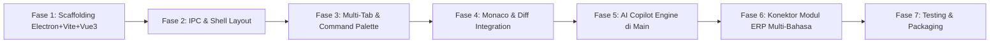

# Log Rebuild: Makarya ERP / IDE Workspace Shell

Dokumen ini mencatat seluruh keputusan arsitektural, standar teknologi yang disepakati, dan panduan teknis yang diintegrasikan dari referensi:
- [`electron.md`](file:///d:/Project/Other/makarya-ide/electron.md) (Arsitektur & Keamanan Electron Modern)
- [`monaco.md`](file:///d:/Project/Other/makarya-ide/monaco.md) (Konfigurasi Monaco Editor & Worker)
- [`primevue.md`](file:///d:/Project/Other/makarya-ide/primevue.md) (Komponen UI Enterprise & Theming Aura)
- [`vue3.md`](file:///d:/Project/Other/makarya-ide/vue3.md) (Composition API, `<script setup>`, Pinia, `<KeepAlive>`)
- [`CODE_STYLE_GUIDE.md`](file:///d:/Project/Other/makarya-ide/CODE_STYLE_GUIDE.md) (Standar Kualitas & Penulisan Kode Wajib: Naming, No Abbreviations, Error Handling, Clean Code)

---

## 1. Profil & Target Arsitektur

* **Nama Proyek:** Makarya Workspace (IDE-Class ERP Shell)
* **Visi Produk:** Shell aplikasi desktop berkelas, cepat, dan modern untuk sistem bisnis/ERP multi-modul. Memiliki *feel* responsif layaknya IDE (Zed/VS Code), dilengkapi Multi-Tab Workspace, Global Command Palette (`Ctrl+K`), Monaco Editor untuk formula/diff/scripting, serta asisten AI Agent otonom yang terintegrasi langsung di main process.
* **Karakteristik Kunci:**
  * **Zero Bloat & Fast:** Tab switching instan menggunakan Vue 3 `<KeepAlive>` dan Pinia store tanpa re-render berulang.
  * **Enterprise Data Ready:** Komponen `DataTable` (PrimeVue 4) dengan dukungan lazy loading, virtual scroll, dan multi-filter untuk ribuan baris data.
  * **Aman (Security-First):** Mematuhi standar keamanan Electron modern (`nodeIntegration: false`, `contextIsolation: true`, `sandbox: true`).
  * **Multi-Language Backend Friendly:** Siap menjadi frontend bagi modul PHP legacy (seperti `Hrms.Sni`), maupun microservices baru (Python/Go/Node.js) melalui REST API / IPC Gateway.

---

## 2. Matriks Teknologi Terpilih

| Layer | Teknologi | Peran & Catatan Implementasi |
|---|---|---|
| **Desktop Shell** | Electron (v32+) | Runtime desktop cross-platform dengan akses native OS di Main Process. |
| **Tooling & Bundler** | `electron-vite` (Vite 5+) | Build tool super cepat untuk Main, Preload, dan Renderer (HMR instan). |
| **Frontend Framework** | Vue 3 (Composition API) | `<script setup lang="ts">`, SFC, dynamic components. |
| **State Management** | Pinia | Workspace tabs store, navigation store, user session, modal state. |
| **UI Component Library**| PrimeVue 4 | Preset tema `Aura`, ToastService, ConfirmDialog, Form + Zod, DataTable. |
| **Styling & Layout** | Tailwind CSS + PrimeUI | `@primeuix/themes`, utility layout, flexbox, dark-mode native toggle. |
| **Icons** | PrimeIcons (`primeicons`) | Icon pack konsisten untuk UI dan tombol aksi. |
| **Code & Diff Editor** | Monaco Editor | `monaco-editor` dengan Vite worker loader, `ITextModel` terpisah dari view, Diff Editor untuk perbandingan usulan AI. |
| **AI Agent Engine** | Node.js (Main Process) | Streaming SSE token, `node:child_process.spawn()` untuk streaming terminal output, Tool Calling / Model Context Protocol (MCP). |
| **Komunikasi IPC** | Electron `contextBridge` | `ipcMain.handle` ↔ `ipcRenderer.invoke` yang diketik ketat via TypeScript types. |

---

## 3. Ketentuan & Best Practices (Wajib Dipatuhi)

### A. Keamanan Electron (dari `electron.md`)
1. **Dilarang keras** menyetel `nodeIntegration: true`. Renderer process murni sandboxed.
2. Semua akses native (filesystem, eksekusi command, database, API calls rahasia) ditaruh di **Main Process** dan diekspos secara terbatas melalui `preload.js` dengan `contextBridge.exposeInMainWorld('makaryaAPI', { ... })`.
3. Komunikasi request-response menggunakan pola `ipcRenderer.invoke()` dan `ipcMain.handle()`.

### B. Konfigurasi Monaco Editor (dari `monaco.md`)
1. **Setup Worker yang Benar:** Daftarkan `MonacoEnvironment.getWorker` di Vite agar worker tokenizing/validasi (editor, json, ts) berjalan di thread terpisah tanpa error terselubung.
2. **Multi-Tab Model:** Jangan me-recreate instance editor saat berganti tab! Gunakan **satu instance editor**, simpan referensi `ITextModel` di Pinia store, dan panggil `editor.setModel(model)`.
3. **Resize Observer:** Hubungkan container editor dengan `ResizeObserver` untuk memanggil `editor.layout()` otomatis saat dock/panel di-resize.

### C. UI & State Vue 3 (dari `vue3.md` & `primevue.md`)
1. **Multi-Tab Caching:** Gunakan `<KeepAlive>` pada container tab agar state form/input pegawai yang sedang diketik tidak hilang saat berpindah tab.
2. **Command Palette (`Ctrl+K`):** Indeks menu dan shortcut disimpan di state lokal untuk pencarian instan tanpa delay network.
3. **Service Terpusat:** Letakkan `<Toast />` dan `<ConfirmDialog />` satu kali di `App.vue`.

### D. Standar Kualitas & Gaya Penulisan Kode (dari `CODE_STYLE_GUIDE.md`)
1. **Bahasa Inggris & Tanpa Singkatan:** Semua nama variabel, fungsi, interface, type, file, dan folder wajib menggunakan Bahasa Inggris deskriptif utuh (contoh: `activeTabId`, `employeeList`, `isSidebarOpen`; jangan `tabId_tmp`, `emp_arr`, `flg_sb`).
2. **Komentar Efektif (Why, not What):** Komentar tidak boleh sekadar mengulang kode. Gunakan komentar hanya untuk menjelaskan *alasan* (why) dari sebuah keputusan teknis, threshold, atau pemilihan library.
3. **Fungsi Ramping & Satu Tanggung Jawab:** Panjang fungsi maksimal 40–50 baris, parameter maksimal 3–4 (gunakan objek jika lebih), dan jangan gunakan boolean flag ambigu di parameter.
4. **Error Handling Terstruktur:** Dilarang menggunakan *silent catch* (`catch (e) {}` kosong). Selalu log error atau kirim pesan actionable ke pengguna.
5. **Konvensi Casing:** `camelCase` untuk variabel/fungsi, `PascalCase` untuk komponen Vue & Type/Interface, `UPPER_SNAKE_CASE` untuk konstanta, dan prefix `is`/`has`/`can` untuk boolean.

---

## 4. Rundown Task Rebuild Baru

### 🔹 Fase 1 — Setup Fondasi Project (Scaffolding & Tooling)
- [x] Inisialisasi template `electron-vite` dengan Vue 3 & TypeScript di `makarya-ide`.
- [x] Instalasi dependensi:
  - `primevue @primeuix/themes primeicons tailwindcss tailwindcss-primeui`
  - `pinia vue-router`
  - `monaco-editor`
- [x] Konfigurasi Vite untuk Worker Monaco Editor dan Tailwind CSS PrimeUI plugin.
- [x] Konfigurasi `webPreferences` di main process: `nodeIntegration: false`, `contextIsolation: true`, `sandbox: true`.

### 🔹 Fase 2 — Arsitektur IPC & Kerangka Shell UI
- [x] Buat `src/preload/index.ts` dengan interface typed `window.makaryaAPI`.
- [x] Buat layout dasar Shell IDE di `App.vue`:
  - **Top Navigation Bar:** Judul aplikasi, status koneksi, tombol toggle tema dark/light.
  - **Activity Bar (Kiri):** Ikon navigasi (Modul ERP, Formula Editor, Terminal, Settings).
  - **Content Area (Tengah):** Dynamic tab container dengan `<KeepAlive>`.
  - **Copilot Sidebar (Kanan):** Panel AI Assistant collapsible.
  - **Status Bar (Bawah):** Status sistem, NIK aktif, branch ID, latency.

### 🔹 Fase 3 — Multi-Tab Workspace & Global Command Palette (`Ctrl+K`)
- [x] Buat Pinia Store: `useWorkspaceStore` (kelola daftar open tabs, active tab ID, dirty state).
- [x] Implementasi Tab Header (bisa di-close, indikator dot jika data belum disimpan).
- [x] Implementasi Modal Command Palette (`Ctrl+K`):
  - Shortcut instan: lompat ke modul, cari menu, panggil aksi cepat, buka tab baru.
- [x] Pasang `ToastService` dan `ConfirmationService` terpusat di root.

### 🔹 Fase 4 — Integrasi Monaco Editor, File Explorer & Real File I/O
- [x] Buat komponen `MonacoEditor.vue` reusable dengan auto-layout via `ResizeObserver`.
- [x] Implementasi manajemen `ITextModel` untuk file kode multi-tab dengan deteksi bahasa otomatis (`languageDetector.ts`).
- [x] Implementasi **File Explorer** (`FileExplorer.vue` & `FileTreeNode.vue`) dengan dialog native "Buka Folder Project" (`dialog.showOpenDialog`).
- [x] Implementasi **File Explorer CRUD Operations**:
  - Tombol New File (`+ File`) & New Folder (`+ Folder`) di header dan hover action per folder.
  - Dialog Rename & dialog Konfirmasi Hapus permanen (`ConfirmDialog` PrimeVue).
  - Fitur **Copy, Paste, & Duplicate Berkas/Folder**:
    - Salin file atau folder penuh (`copyEntry` via `fs/promises.cp`).
    - Duplikasi langsung dalam satu klik dengan auto-naming cerdas (`foo copy.ext`, `foo copy 2.ext`).
    - Tempel (*Paste*) ke folder tujuan atau langsung ke root explorer.
    - Indikator visual clipboard aktif (banner informatif di explorer + outline item disalin).
  - **Right-Click Context Menu & Resizable Sidebar (UX Upgrade):**
    - Seluruh tombol aksi hover dihapus dari baris tree sehingga nama file dan folder kini memiliki ruang penuh (`100% full width`) tanpa terpotong `...`.
    - Menu konteks klik kanan ala VS Code / Zed (`openContextMenu`): File Baru, Folder Baru, Salin (`Ctrl+C`), Duplikat, Paste (`Ctrl+V`), Ubah Nama (`F2`), dan Hapus (`Del`).
    - Sidebar kini dapat diubah ukurannya secara bebas dengan menarik batas kanan sidebar (*draggable border resize*).
  - Sinkronisasi otomatis pohon file dan penutupan tab saat file dihapus.
- [x] Implementasi **Real File I/O**:
  - Membaca file nyata dari disk ke tab Monaco Editor.
  - Menyimpan file nyata ke disk dengan shortcut global **`Ctrl+S`**.
  - Indikator perubahan (*dirty state dot*) pada tab dan status bar.
- [x] Verifikasi syntax highlighting (PHP, JS, TS, Vue, HTML, CSS, JSON, SQL, Python, Rust, Markdown) dan Monaco web workers di Vite.

### 🔹 Fase 5 — AI Copilot Engine (Streaming, Child Process, MCP)
- [x] Setup AI Agent Engine di **Main Process** (`src/main/agent/aiService.ts`):
  - Terhubung ke endpoint 9router (`http://172.19.100.101:20128/v1`) dengan model `Antigravity`.
  - Dukungan streaming token SSE real-time dengan `AbortController` untuk menghentikan jawaban di tengah jalan.
  - Pengambilan daftar model dinamis (`Antigravity`, `OpenCode`, `ag/gemini-3.8-flash-high`).
- [x] Integrasi Preload IPC Gateway (`agent:chat-stream`, `agent:chat-abort`, `agent:get-models`).
- [x] Pinia Store AI (`agentStore.ts`):
  - Riwayat percakapan reaktif.
  - Active File Context Injection (mengirim nama file, lokasi, dan isi kode file yang sedang terbuka ke prompt AI).
- [x] UI Copilot Chat di Renderer (`AgentPanel.vue` & `markdownParser.ts`):
  - Model switcher dropdown di header.
  - Badge konteks file aktif (`📎 robots copy.txt`) dengan toggle.
  - Tombol aksi cepat: Cari Bug, Jelaskan File, Refactor, Tulis Dokumentasi.
  - Blok kode Markdown interaktif dengan tombol **Salin** dan tombol **Terapkan ke Editor** (menggantikan/menyisipkan kode langsung ke tab aktif).

### 🔹 Fase 6 — Konektor Modul ERP (Multi-Bahasa)
- [ ] Buat HTTP Client / API Gateway adapter di main process untuk komunikasi ke server PHP (`Hrms.Sni`) atau microservice lain.
- [ ] Buat halaman modul contoh (misal: *Daftar Kontrak Pegawai* menggunakan PrimeVue `DataTable` + lazy loading).
- [ ] Hubungkan AI Copilot dengan tool bisnis (misal: "Carikan data kontrak pegawai NIK X").

### 🔹 Fase 7 — Verifikasi, Hardening, & Packaging
- [ ] Audit keamanan Electron (CSP headers, sanitize input).
- [ ] Pengujian memory leak saat membuka dan menutup 20+ tab.
- [ ] Setup `electron-builder` untuk build installer Windows (`.exe` / portable).
